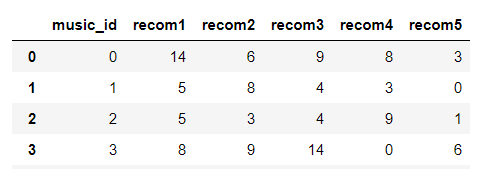

# MusicData Analysis for Recommendation

음악 데이터 특징 분석으로 유사 음악 찾기를 목표한다.
-- https://0equal2.tistory.com/133?category=478380


1. 음악 데이터 특징값 추출
2. 데이터 시퀀스 유사 비교
3. 유사 곡 추천리스트 반환

#### MusicData Features

- Chromagram
- MelSpectrogram
- Spectral Centroid
- Spectral Rolloff


## 1-1. Data File Load
- [Data collect](https://0equal2.tistory.com/136)
-- ![result]<result_image/MusicData_load_2-1.PNG>


- Import library

```python
#1. 음악 데이터 파일 로드에 필요한 라이브러리 
import IPython.display
import pandas as pd
```

- [File Load](https://0equal2.tistory.com/137) (filename='music_inform.csv')


```python
#2. 음악 정보 파일 불러오기 : origin_music
# music_inform.csv 
origin_music=pd.read_csv('music_inform.csv')
```
수집한 데이터에서 곡ID(ID)와 곡의 위치 열만 추출(path)
-- ![result]<result_image/MusicData_load_2-1.PNG>


## 1-2. Feature Analysis

- [Chromagram](https://0equal2.tistory.com/138)
```python
#크로마그램 추출
chroma_stft=librosa.feature.chroma_stft(y=y,sr=sr)
```
- MelSpectrogram
```python
#melspectrogram 추출
mfcc=librosa.feature.mfcc(y=y,sr=sr)
mel_spectrogram=librosa.feature.melspectrogram(y=y,sr=sr,n_mels=128)
```
- [Spectral Centroid](https://0equal2.tistory.com/144)
```python
#spectral_centroid 추출
s_c=librosa.feature.spectral_centroid(y,sr=sr)
```
- [Spectral Rolloff](https://0equal2.tistory.com/144)
```python
#spectral_rolloff_max 추출
r_o_max=librosa.feature.spectral_rolloff(y,sr=sr,roll_percent=0.99)
r_o_min=librosa.feature.spectral_rolloff(y,sr=sr,roll_percent=0.01)
```

## 2. Data Sequence Similarity
음악 데이터 특징값 시퀀스 유사도는 보통 동일 곡(표절 곡) 찾기를 목표로하고있다. 이는 음악 데이터 특징상 프레임을 잘게 나누어 계산하기때문에 많은 계산량이 필요하다. 하지만 본 프로젝트의 목표는 유사곡 추천이기 때문에 시퀀스가 완전히 일치하기보다는 멜로디 흐름과 전체적 분위기가 유사함을 구한다. 그러므로 시퀀스 유사도에서 완전한 시간에 대해 일치하는 유클리디안 유사 비교보다는 약간의 시간의 오차를 허용하는 [동적시간와핑(DTW)](https://0equal2.tistory.com/142)로 유사 비교를 하였다. 

프레임의 개수 : F
Return of (Spectral Centroid, Spectral Rolloff) : [1:F]
Return of Chromagram : [12:F], 12 pitches
Return of MelSpectogram : [13,F], 13 melscales


- DTW for (Spectral Centroid, Spectral Rolloff), [1:F]

```python
#5. DTW함수
def DTW(a,b,length):
    #5-1. dtw를 구하기 위한 행렬
    dtw=[[0 for i in range(length)] for j in range(length)]
    
    #5-2. dtw 첫행값 구하기
    dtw[0][0]=abs(a[0]-b[0])
    
    for dj in range(1,length):
        dtw[0][dj]=dtw[0][dj-1]+abs(a[0]-b[dj])
    
    #5-3. dtw 첫열값 구하기
    for di in range(1,length):
        dtw[di][0]=dtw[di-1][0]+abs(a[di]-b[0])
        
    #5-4. dtw 채우기
    for di in range(1,length):
        for dj in range(1,length):
            min_dtw=min(min(dtw[di-1][dj-1],dtw[di-1][dj]),dtw[di][dj-1])
            
            dtw[di][dj]=min_dtw+abs(a[di]-b[dj])
            
    #5-5. 최종 dtw 유사거리
    return dtw[length-1][length-1]
```

- DTW for (Chromagram, MelSpectogram), [n:F]
각 프레임별로 mfcc 계수의 유클리디안 거리 계산으로 [n:F]를 [1:F]로 변환
```python
#5-0. mfcc 13계수의 차이값 구하기
def mfcc_difference(mfcc1,mfcc2):
    difference=0
    
    for i in range(13):
        difference+=abs(mfcc1[i]-mfcc2[i])
        
    return difference
```
```python
#i곡과 j곡의 유사 구하기
for i in range(n):
    for j in range(i,n):
        
        #동일 곡과의 유사도는 구하지 않음 
        if i==j:
            continue 
            
        #5-1. dtw를 구하기 위한 행렬
        dtw=[[0 for i in range(frame_num)] for j in range(frame_num)]
        
        #5-2. dtw 첫행값 구하기
        dtw[0][0]=mfcc_difference(mfcc_info[i][0],mfcc_info[j][0])
        
        for dj in range(1,frame_num):
            dtw[0][dj]=dtw[0][dj-1]+mfcc_difference(mfcc_info[i][0],mfcc_info[j][dj])
        
        #5-3. dtw 첫열값 구하기
        for di in range(1,frame_num):
            dtw[di][0]=dtw[di-1][0]+mfcc_difference(mfcc_info[i][di],mfcc_info[j][0])
            
        #5-4. dtw 채우기
        for di in range(1,frame_num):
            for dj in range(1,frame_num):
                min_dtw=min(min(dtw[di-1][dj-1],dtw[di-1][dj]),dtw[di][dj-1])
                
                dtw[di][dj]=min_dtw+mfcc_difference(mfcc_info[i][di],mfcc_info[j][dj])
                
        #5-5. 최종 dtw 유사거리 저장
        similarity[i][j]=int(dtw[frame_num-1][frame_num-1])
        similarity[j][i]=int(dtw[frame_num-1][frame_num-1])
        
        #현재 진행상황 파악하기 위한 print
        print('[',i,']','[',j,']의 유사도 : ', similarity[i][j])
```
## 3. 유사 곡 추천리스트 반환

우선 각 특징에 대해서 시퀀스 흐름 유사비교하여 유사곡 5곡씩을 뽑아보았다.
[music_id, recom1, recom2, recom3, recom4, recom5]
기준곡(music_id)에 대해서 추천곡 5개(reocm1~5) 결과를 csv형태의 파일로 저장하였다.

-- 


[//]: # (These are reference links used in the body of this note and get stripped out when the markdown processor does its job. There is no need to format nicely because it shouldn't be seen. Thanks SO - http://stackoverflow.com/questions/4823468/store-comments-in-markdown-syntax)

   [dill]: <https://github.com/joemccann/dillinger>
   [git-repo-url]: <https://github.com/joemccann/dillinger.git>
   [john gruber]: <http://daringfireball.net>
   [df1]: <http://daringfireball.net/projects/markdown/>
   [markdown-it]: <https://github.com/markdown-it/markdown-it>
   [Ace Editor]: <http://ace.ajax.org>
   [node.js]: <http://nodejs.org>
   [Twitter Bootstrap]: <http://twitter.github.com/bootstrap/>
   [jQuery]: <http://jquery.com>
   [@tjholowaychuk]: <http://twitter.com/tjholowaychuk>
   [express]: <http://expressjs.com>
   [AngularJS]: <http://angularjs.org>
   [Gulp]: <http://gulpjs.com>

   [PlDb]: <https://github.com/joemccann/dillinger/tree/master/plugins/dropbox/README.md>
   [PlGh]: <https://github.com/joemccann/dillinger/tree/master/plugins/github/README.md>
   [PlGd]: <https://github.com/joemccann/dillinger/tree/master/plugins/googledrive/README.md>
   [PlOd]: <https://github.com/joemccann/dillinger/tree/master/plugins/onedrive/README.md>
   [PlMe]: <https://github.com/joemccann/dillinger/tree/master/plugins/medium/README.md>
   [PlGa]: <https://github.com/RahulHP/dillinger/blob/master/plugins/googleanalytics/README.md>
